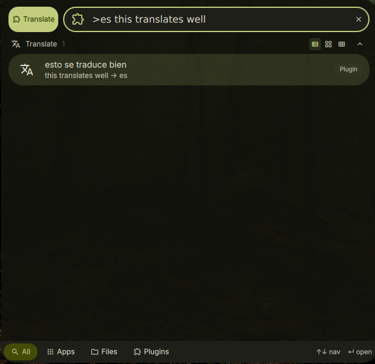

# DankTranslate

A launcher plugin for [DankMaterialShell](https://github.com/AvengeMedia/DankMaterialShell) that translates text between languages using [translate-shell](https://github.com/soimort/translate-shell).



## Features

- Translate text from the launcher with debounced async results
- Default target language (configurable, defaults to English)
- Override target language with a prefix code (e.g. `pt`, `ja`, `es`)
- Copy translations to clipboard on selection

## Installation

### Nix (flake)

Add as a `flake = false` input and include in your DMS plugin configuration:

```nix
inputs.dms-plugin-translate = {
  url = "github:alcxyz/DankTranslate";
  flake = false;
};
```

```nix
programs.dank-material-shell.plugins.dankTranslate = {
  enable = true;
  src = inputs.dms-plugin-translate;
};
```

### Manual

Copy the plugin directory to `~/.config/DankMaterialShell/plugins/DankTranslate/`.
For an identifiable development build, stage `dist/dev` first and copy
`dist/dev/share/dms-plugins/DankTranslate/` instead of the raw checkout.

## Usage

Activate with `>` (default trigger) in the DMS launcher, then:

- `>hello world` — translate to English (default)
- `>pt hello world` — translate to Portuguese
- `>ja good morning` — translate to Japanese
- Select a result to copy it to clipboard

## Requirements

- [translate-shell](https://github.com/soimort/translate-shell) (`trans` command)
- `wl-copy` — Wayland clipboard utility

+## Development builds

The tracked manifest keeps the release version. To stage an identifiable
development package, run:

```bash
python3 scripts/package.py --output dist/dev
```

This produces a manifest version like `X.Y.Z-dev.<commit>`; a dirty checkout
adds `.dirty`. For Nix, use `pkgs.callPackage ./default.nix { revision = ...; }`.
Release packaging is guarded and requires a clean checkout at the exact
`vX.Y.Z` tag.

## License

MIT

<details>
<summary>Support</summary>

- **BTC:** `bc1pzdt3rjhnme90ev577n0cnxvlwvclf4ys84t2kfeu9rd3rqpaaafsgmxrfa`
- **ETH / ERC-20:** `0x2122c7817381B74762318b506c19600fF8B8372c`
</details>
